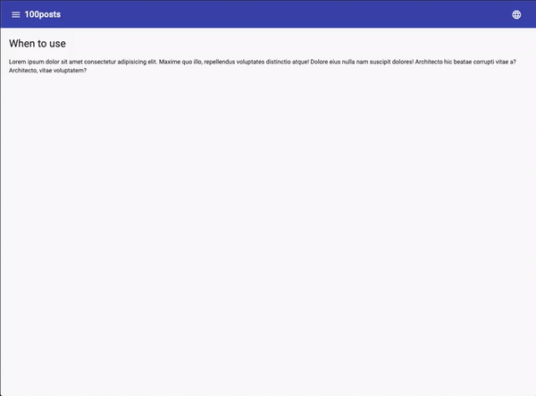

# 100posts

## Environment

This project was started using [Angular CLI](https://github.com/angular/angular-cli/blob/master/README.md) with some changes listed below.

What's inside?:

- Latest and greatest [Angular v10.1.2](https://angular.io)
- [yarn](https://classic.yarnpkg.com) is used against [npm](https://www.npmjs.com)
- Removed [tslint](https://palantir.github.io/tslint) ([deprecated](https://medium.com/palantir/tslint-in-2019-1a144c2317a9)) added [eslint](https://eslint.org) with [prettier](https://prettier.io)
- Replaced unit tests with [Jest](https://jestjs.io)
- Replaced e2e with [Cypress](https://www.cypress.io) and includes Cucumber (Gherkin) language
- Implemented HMR (hot module replacement)
- Added multilingual support in angular way
- Code style using [prettier](https://prettier.io) and [eslint](https://eslint.org)
- SCSS code style handled by [StyleLint](https://stylelint.io) + [prettier](https://prettier.io)
- Added git hooks. Before each commit code linting is performed
- Added PWA (can be installed as desktop app)
- Lazy Loaded modules
- Demo with Navigation
- Auto deployment using github actions and githup pages

## Demo

### [Live demo](https://fdiskas.github.io/100posts)

Example without rxjs is on branch: `no-rxjs`

